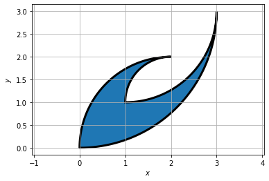
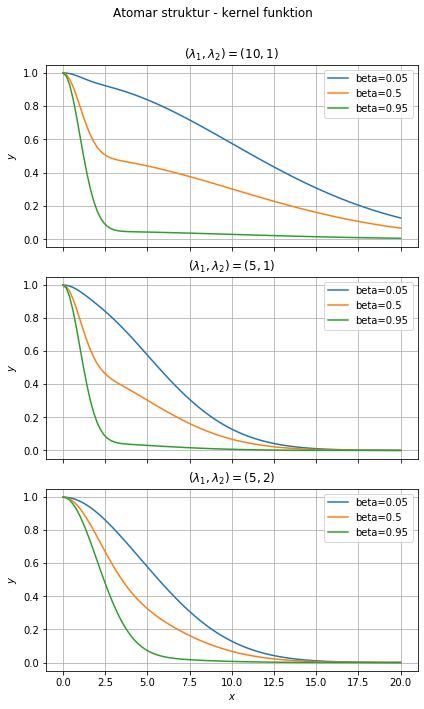

Aflevering 1


```python
#Opg 1.4

%matplotlib inline
import matplotlib.pyplot as plt
import numpy as np

fig, ax = plt.subplots()
plt.axis('equal')
ax.grid()


#den nederste
thetas = np.linspace(-np.pi/2,0)
radius=3
x1 = radius*np.cos(thetas)+0
y1 = radius*np.sin(thetas)+3


#den mellemste stor
thetas = np.linspace(0,-np.pi/2)
radius=2
x3 = radius*np.cos(thetas)+1
y3 = radius*np.sin(thetas)+3


#den mellemste lille
thetas = np.linspace(np.pi,np.pi/2)
radius=1
x5 = radius*np.cos(thetas)+2
y5 = radius*np.sin(thetas)+1


#den øverste 
thetas = np.linspace(np.pi/2,np.pi)
radius=2
x7 = radius*np.cos(thetas)+2
y7 = radius*np.sin(thetas)+0

xs=np.concatenate((x1,x3,x5, x7))

ys=np.concatenate((y1,y3, y5, y7))

ax.fill(xs,ys, linewidth=3,edgecolor='k')
ax.set_xlabel('$x$')
ax.set_ylabel('$y$')
```


    Text(0, 0.5, '$y$')





```python
#Opg 1.7
```


```python


fig, axs = plt.subplots(3,1,sharex=True,figsize=(6,10))
fig.suptitle('Atomar struktur - kernel funktion')

ls=[(10,1), (5,1), (5,2)]


xs=np.linspace(0,20,100)

betas=[0.05, 0.5, 0.95]
f= lambda x,beta: (1-beta)*np.exp(-x**2/(2*l1**2))+beta*np.exp(-x**2/(2*l2**2))


for ax,l in zip(axs,ls):
    l1=l[0]
    l2=l[1]
    for beta in betas:
        #ys=f(beta)
        ax.plot(xs, f(xs,beta))
        
    ax.grid()
        
    ax.legend([r'beta={}'.format(beta) for beta in betas])
    ax.set_ylabel('$y$')
    ax.set_title('($\lambda_1 , \lambda_2) ={}$'.format(l))
    
        
ax.set_xlabel('$x$')
fig.tight_layout()
fig.subplots_adjust(top=0.90)
```





```python

```
